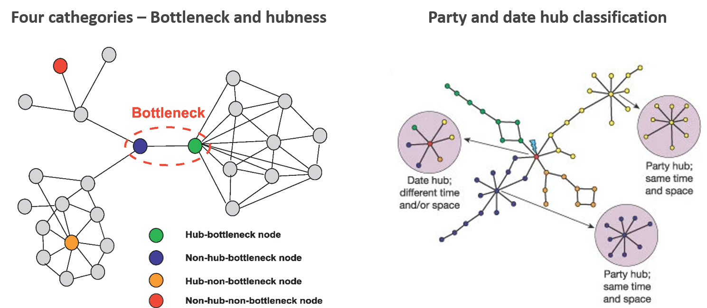
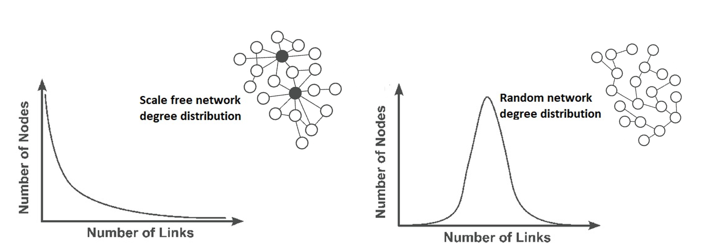

```{r setup, include=FALSE}
knitr::opts_chunk$set(echo = TRUE)
```


#### **Bioinformatics for Computational Genomics - Advanced Genomics project n2 - July 2021**


This project consists in the integration of the four protein categories that can
be defined combining hubs and bottlenecks concepts, with the idea of party and 
date hubs starting from Escherichia coli interactome and gene expression compendium.


### **Index**
1. **Background**
2. **Data processing**
    1. *Package attachment*
    2. *Datasets description*
      1. *Experiment score distribution*
      2. *Transferred experiment score distribution*
    3. *Confidence based subset selection*
    4. *Interaction network generation*
3. **Results**
    * ___Larger interaction network___
      1. *Bottleneck and hubness classification*
      2. *Party & date integration*
      3. *Structure evaluation*
          1. *Similarity heatmaps - BH*
          2. *Similarity heatmaps - NBH*
      4. *Inner structure evaluation*
    * ___Smaller interaction network___
      1. *Bottleneck and hubness classification*
      2. *Party & date integration*
      3. *Structure evaluation*
          1. *Similarity heatmaps - BH*
          2. *Similarity heatmaps - NBH*
      4. *Inner structure evaluation*
4. **Conclusion**
5. **References**


### **1. Background**


**Escherichia coli** is a Gram-negative, facultative anaerobic bacterium that can be
cultured inexpensively in a laboratory setting. Therefore, it is the most widely
used prokaryotic model organism in biotechnology and microbiology. Harmless E.coli 
strains are part of **gut microbiota** of warm-blooded organisms, 
such as humans, where they have a **pivotal role** in preventing the colonisation of
the intestine by pathogenic bacteria.


In E. coli, as in all living beings, **every biological function** and response, 
such as metabolism, cell cycle etc.,
is the **result of the dynamical interaction** between molecules, including proteins.
In order to address this complexity, systems biology takes advantage of networks
as models to represent how individual components relates to eachother in a system
of interest. 


Among the topological properties of a network, the two main ones for this project are:


* **Degree**: edges connected to a node. Nodes with high degree correspond to **hubs**, nodes that interact with many others;


* **Shortest path betweenness centrality**: measure of centrality of the nodes in a network. It evaluates the total number of non-redundant shortest paths going through a certain node or edge;


Combining the two properties above, it is possible to define four categories of 
proteins: non-bottleneck hubs (**NBH**), bottleneck hubs (**BH**), bottleneck 
non-hubs (**BNH**) and non-bottleneck non-hubs (**NBNH**).


In addition, it is possible to classify hubs of the protein-protein interaction network  based on time an space into:


* **Party** hubs or stable hubs: nodes with many dependent and simultaneous links with most of their neighbors;


* **Date** hubs or modulated/changing behaviour hubs: nodes that have many targets, but interact with specific neighbors (only one or a few of them) specifically in time/condition and space.
This classification can be performed starting from gene expression information, 
since the interaction among two proteins can only take place if the two proteins
are expressed at the same moment.





This project aims at **integrating the four categories** described above 
(NBH, BH, BNH, NBNH) **with the party and date hubs** classification using an 
interactome for E. coli and the gene expression compendium.


### **2. Data Processing**


#### *2.1 Package attachment*


```{r attach necessary packages, message= FALSE}
library(igraph)
library(diptest)
library(pheatmap)
library(uwot)
library(scatterplot3d)
library(tidyverse)
library(dplyr)
library(ggplot2)
library(RColorBrewer)
library(mclust)
```

```{r set directory, echo = FALSE}
setwd("C:/Users/User/Desktop/P&D_projectErconi_BCG")
```


#### *2.2 Datasets Description*


Protein-protein interaction networks (PPI) are high throughput datasets obtained
from large amount of data generated with experimental approaches. In this network,
nodes are proteins and edges represent stable or transient in time physical 
contact or electrostatic interaction between the two connected proteins.

The first provided dataset consists in an experimentally defined 
**interaction network** table available on STRING.

```{r load PPI net}
## E.coli PPI network
EcoPPI<-read.table("511145.protein.physical.links.full.v11.0.txt",header=TRUE)
EcoHead <- head(EcoPPI)
knitr::kable(EcoHead, format="html")
```


Each of the 368'774 rows represent an interaction couple protein1-protein2 with 
8 different **confidence indexes** in range 0-1000, corresponding respectively 
to lowest confidence to highest confidence, attributed by STRING. Please, notice
that the confidence is not referred to the quality of the interaction itself as,
for example, strenght or specificity. Indeed, it indicated the STRING evaluation
of the **truthfulness of the interaction** evaluated.


The second dataset is **E.coli gene expression compendium** built using RNA-seq 
libraries from SRA in an automatic fashion. 


```{r load compendium}
## E.coli gene expression compendium 
load("Ecoli_compendium.RData") 
```


It contains gene expression data in 
form of:


* `ALL_FINAL_Nreads`: "raw" read counts in a count table in which each row correspond to a gene and each column correspond to a sequenced sample;


* `ALL_FINAL_TPM`: transcripts per million (TPM) values obtained normalizing read counts by library size and gene lenght;


* `ZL2`: dataset of filtered and normalized TPM values, reduces inter-library differences.


#### *2.3 Confidence evaluation* {.tabset .tabset-fade}

It is crucial to filter the PPI network since hubs connected by false-positive 
interactions would be uncorrelated in mRNA expression with their interaction
partners and would resemble date hubs. For this reason, we filter based on
**experiment score** and **transferred experiment score** thresholds.

We evaluated the distribution of both scores:


##### *2.3.1. Experiment score distribution*

The E.coli PPI network dataframe contains a numeric column called 'experiment' 
with values in the range 0-900 that is used to indicate confidence of the
listed interactions. Higher the value, higher the confidence. In this section we
check for the distribution of its values with an histogram.

```{r experiment confidence index distribution }

hist(EcoPPI$experiments, col= "dodgerblue", main="Confidence value distribution - experiment",
     xlab= "Confidence Value", ylab="Number of interactions",xlim=c(0,900), breaks= 50)

## we see a very big number of interactions with experiment confidence near 0
## try to investigate how many rows have 0 in that column out of 368'774 proteins
ZeroExpNum <- sum(EcoPPI$experiments == 0)
ZeroExpPercent <-trunc(ZeroExpNum/ nrow(EcoPPI) *100)

print(paste("Evaluating the number of interactions with experiment confidence near 0 we found", ZeroExpNum, "interactions that correspond to", ZeroExpPercent, "% of the total."))

```


This percentage correspond to the peak of **experiment** confidence score distribution.
Thus, we remove the identified rows to get a better visualization of the distribution.

```{r confidence index experiment - filtering}

badExp<-0
EcoPPIgoodEXP <-as.data.frame(cbind(EcoPPI$protein1[EcoPPI$experiments>badExp],
                                    EcoPPI$protein2[EcoPPI$experiments>badExp],
                                    EcoPPI$experiments[EcoPPI$experiments>badExp]))

## Get number of remaining protein couples
ppCouple <- nrow(EcoPPIgoodEXP)
print(paste("After removal of 0 experiment confidence rows, we are left with", ppCouple, "protein-protein interactons"))

## Assign column names
newColNames <- c("protein1", "protein2", "experiments")
colnames(EcoPPIgoodEXP) <- newColNames
#sapply(EcoPPIgoodEXP , class)

## The class character gives problems in the histogram, change it
EcoPPInumeric <- transform(EcoPPIgoodEXP, experiments = as.numeric(experiments))

## Investigate the distributions

hist(EcoPPInumeric$experiments, col= "dodgerblue", main="Confidence value distribution - Experiment",
     xlab= "Confidence Value", ylab="Number of interactions", xlim=c(1,900), ylim= c(0, 1000), breaks= 50)
```


##### *2.3.2. Transferred experiment score distribution*

The E.coli PPI network dataframe contains a numeric column called ' transferred experiment' with values in range 0-900 that is used to indicate confidence of the
listed interactions given by different experiments. Higher the value, higher the confidence.
In this section we check for the distribution of its values with an histogram as we did for the experiment score.

```{r confidence index distribution dataset description - Transferred}

hist(EcoPPI$experiments_transferred, col= "dodgerblue", 
     main="Confidence value distribution - transferred experiment",
     xlab= "Confidence Value", ylab="Number of interactions",xlim=c(0,900), breaks= 50)


## Also in this case we see a very big number of confidence near 0
## try to investigate how many rows have 0 in that column out of 368'774 proteins
ZeroExpTNum <- sum(EcoPPI$experiments_transferred == 0)
ZeroExpTPercent <- trunc(ZeroExpTNum/ nrow(EcoPPI) *100)

print(paste("While, the same evaluation for transferred experiment confidence showed", ZeroExpTNum, "interactions that correspond to", ZeroExpTPercent, "% of the total."))

```


This percentage correspond to the peak of **transferred experiment** confidence score distribution.
Thus, we remove the identified rows to get a better visualization of the distribution.

```{r confidence index distribution - transferring experimental info}

## Remove all the rows with 0 as value --> very low confidence
badExp<-0
EcoPPIgoodEXPT <-as.data.frame(cbind(EcoPPI$protein1[EcoPPI$experiments_transferred>badExp],
                                     EcoPPI$protein2[EcoPPI$experiments_transferred>badExp],
                                     EcoPPI$experiments_transferred[EcoPPI$experiments_transferred>badExp]))

## Get number of remaining protein couples --> we remain with a half more or less 
ppTcouple <- nrow(EcoPPIgoodEXPT)
print(paste("After removal of 0 transferred experiment confidence rows, we are left with", ppTcouple, "protein-protein interactons"))

## Assign column names
newColNamesT <- c("protein1", "protein2", "experiments_transferred")
colnames(EcoPPIgoodEXPT) <- newColNamesT
#sapply(EcoPPIgoodEXPT , class)

## The class character gives problems in the histogram, change it
EcoPPInumericT <- transform(EcoPPIgoodEXPT, experiments_transferred = as.numeric(experiments_transferred))

## Investigate distribution
hist(EcoPPInumericT$experiments_transferred, col= "dodgerblue", main="Confidence value distribution - Transferred",
     xlab= "Confidence Value", ylab="Number of interactions", xlim=c(1,900), ylim= c(0, 30000), breaks= 50)
```


#### *2.3 Confidence based subsets selection*

Starting from PPI network and gene expressions, we obtain a dataframe with both information.

```{r Merge PPI and Gene Expression}

## Convert to df
Expr <- as.data.frame(ZL2)
## Protein names are in rownames, we want to extract them in a column 
Expr$protein <- row.names(Expr)
EcoPPI_GeneExpr <- merge(EcoPPI, Expr, by.x="protein1", by.y="protein")
```

The final criteria for the filtering needs to take into account the need to prevent the loss 
of information while keeping meaningful interactions. 

For this reason, we perform the evaluation on the results of two different thresholds.
The first dataset contans interactions with experiment score >100.

Than, since we notice that 
some of them have low transferred experiment or 0, we take the subset with transferred experiments score higher than 100, sure to loose almost half of the information but keeping high confidence interactions.


```{r filtering}
## Filter on experiment - Larger dataset
EcoPPIint_exp100 <- EcoPPI_GeneExpr %>% filter (experiments >= 100)
dimL <- nrow(EcoPPIint_exp100)
print(paste("Larger dataset contains", dimL, "interactions"))

## Add Filter on transferred - Smaller dataset
EcoPPIint_intersect100 <- EcoPPIint_exp100 %>% filter (experiments_transferred >= 100)
dimS <- nrow(EcoPPIint_intersect100)
print(paste("Smaller dataset contains", dimS, "interactions"))

```


#### *2.4 Interaction network generation* 


Once performed the filtering, we transform the dataframes in igraph networks.


```{r GetNetwork}
## Obtain the interaction network for the larger subset
IgNetwork <-graph.data.frame(EcoPPIint_exp100 )
## Describe it in terms of number of connected edges
ConnectedEdges <-components(IgNetwork)

print(paste("The obtained network contains", length(unique(ConnectedEdges$membership)), "connected components."))

## Obtain the interaction network for the smaller subset
IgNetworkI <-graph.data.frame(EcoPPIint_intersect100)
## Describe it in terms of number of connected edges
ConnectedEdgesI <-components(IgNetworkI)

print(paste("The obtained network contains", length(unique(ConnectedEdgesI$membership)), "connected components."))
```


The organization of a network is characterized by the **degree distribution shape**.
The degree distribution can be either Bell shaped, for random networks, or
exponential shaped, for power-law networks.
This type of organization is typical of biological networks, so we expected an 
exponential shape degree distribution for our network. 





Plotting the distribution for a check we observed, as expected, a degree 
distribution curve **following a power law function**. This means that the network is heterogeneous and
made of few nodes with a big degree, so few hubs, and many nodes with few connections.

```{r Degree distribution}

par(mfrow=c(1,2))
degreeDistr <- degree_distribution(IgNetwork, cumulative=T, mode="all")
plot( x=0:max(degree(IgNetwork)), y=degreeDistr, type= "l", lwd= 5, col="dodgerblue",
      xlab="Degree (k)", ylab="Degree distribution P(k)", main="P(k) shape large network")

degreeDistrI <- degree_distribution(IgNetworkI, cumulative=T, mode="all")
plot( x=0:max(degree(IgNetworkI)), y=degreeDistrI, type= "l", lwd= 5, col="dodgerblue",
      xlab="Degree (k)", ylab="Degree distribution P(k)", main="P(k) shape small network")
```


### **3. Results** {.tabset .tabset-fade}


We perform the same evaluations on both networks, the larger one obtained with a 
less stringent filter (only on experiment confidence) and the smaller one obtained with the more stringent filter (both experiment and transferred experiments confidence).


#### ___Larger interaction network___ 


##### *3.1 Bottleneck & Hubness classification*


The network was used to define the above node cathegories based on degree 
(to define hubness) and betweenness centrality topological properties
(to define bottlenecks). More precisely, hubs were defined as proteins having 
the 20% highest number of neighbors and bottlenecks as proteins with 20% 
highest total number of non-redundant shortest paths going through them.


```{r Hubness}
## Identify hubs (= proteins with 20% of the total connections)
degrees <-igraph::degree(IgNetwork)

## Select threshold based on quantile
degreeTAU<-quantile(degrees,0.9)
```


```{r Betweenness}
## Bottleneck concept is based on the betweenness centrality metric --> bottleneck == high betweenness
## Calculate betweenness for each node
btw <- betweenness(IgNetwork,directed=FALSE)

## How do label a protein in the PPI as a bottleneck? --> set the threshold
## Based on the quantile
btwTAU<-quantile(btw ,0.9)
```


```{r Bottleneck concept & Hubness integration}
## Integration of the two definitions --> intersection

## Bottleneck-hubs (BH) 
BH <-V(IgNetwork)$name[btw>=btwTAU & degrees>=degreeTAU]

## Non-bottleneck hubs (NBH)
NBH <-V(IgNetwork)$name[btw<btwTAU & degrees>=degreeTAU]

## Bottleneck non-hub (BNH)
BNH <-V(IgNetwork)$name[btw>=btwTAU & degrees<degreeTAU]

## Non bottleneck non hubs (NBNH)
NBNH <-V(IgNetwork)$name[btw<btwTAU & degrees<degreeTAU]

cat("Defining the bottleneck and hubness concepts we obtained:\n",
    length(BH), "Bottleneck-hubs (BH)\n",
    length(NBH), "Non bottleneck-hubs (NBH)\n",
    length(BNH), "Bottleneck-Non hubs (BNH)\n",
    length(NBNH), "Non bottleneck-Non hubs (NBNH)")
```


##### *3.2 Party & date integration*


To identify party and date hubs it is necessary to **integrate gene expression** 
information present in `ZL2` dataset from E. coli compendium. The original 
party/date idea present in litterature is based on the correlation of the hub
under analysis and its neighbor in the network.
This approach works nicely for hubs highly correlated with all of their targets. 
However, if the hub interact with proteins that are not coexpressed, this means
we end up calculating the correlation hub-interactors, for a potentially reduced
number of meaningful samples (the ones where both the hub under analysis and 
the interactors are expressed). 
Moreover, in case of constitutive hubs with small gene expression variation, 
the correlation calculation is not very meaningful or not possible (for constant expression).
Nonetheless, constitutive hubs might interact with different targets at 
different times (date hub) or have targets that are all expressed at the same time
(party hub).


In order to partially overcome these problems, in this project we
focus on the **correlation among interactors only**. 


To do so we define a function that for each node category member calculates a 
correlation matrix of all neighbors of the n-th element of the examined category
vs themselves in all combinations. Then, for each bin in the fixed intervals 
(a range of pearsons correlation coefficients) previously defined, we compute
the relative pearson correlation coefficient occurrences and we store them in a matrix. 

```{r Correlation coefficient distribution function}
## Correlation coefficient distribution calculation for all the interactors of the proteins within each of the Hub categories: NBH and BH
## Define InteractorCorr function to evaluate pearson correlation of interactors of the Hub under evaluation vs themselves given the igraph object and type of hub based on bottleneck evaluation

pearson_vector <- NULL

InteractorCorr <- function(HubsType, igraphNetwork) {
  
    ## We define a range of pearsons correlation coefficients:
    fixed_intervals<-seq(-1.05,1.05,.1)
  
    ## zero matrix
    allpearsons <- matrix(0,ncol=length(fixed_intervals)-1,nrow=length(HubsType))

    for (n in 1:length(HubsType)) {
        ## Get list of interactors of the n-th member of the hub type under evaluation
        hub_interactors <- neighborhood(igraphNetwork,nodes=HubsType[n])[[1]]

        ## Obtain the gene expression
        extractedrows <- ZL2[match(names(hub_interactors),rownames(ZL2)),]
        
        ## Since we are interested in the correlation of interactors of Hubs[n] with Hubs[n]is present
        expressed <- which(extractedrows[1,] > mean(extractedrows[1,]))
        extractedrows <- extractedrows[,expressed]
        
        ## But we don't want Hubs[n] in our evaluation
        extractedrows <- extractedrows[-1,]
    
        ## Correlation matrix: proteins interacting with Hubs[n] vs themselves (all combinations)
        pearsons <- cor(t(extractedrows))
        
        ## Use the upper triangular part (correlation matrix is symmetric)
        pearsons <- pearsons[upper.tri(pearsons)]
        
        ## GMM vector for later 
        pearson_vector <- c(pearson_vector, pearsons)
        
        ## Give same weight to the distribution of pearson value for the different Hubs (values together)
        h <- hist(pearsons, breaks=fixed_intervals, plot= F)
        
        # store the relative occurrences of pearson coefficients
        allpearsons[n,] <- h$counts/sum(h$counts)
    }
    
    ## The midpoints are the column names of the final output
    colnames(allpearsons)<-h$mids
    
    return(list(h, allpearsons, pearson_vector))}


## Based on the output desired between correlation heatmap (Significance map), pearson midpoints (midpoint) we use pearsonEval to prevent the repetition of code
    
pearsonEval <- function(histogram, all_pearsons, output= "midpoints", pcc= 1){ 
    if (output == "SignificanceMap") {
      
      ## Visual evaluation of the grade of similarity of correlation of BH targets 
      if (pcc== 1){
        Breaks2= seq (0, 1, by=0.01)
        pheatmap(all_pearsons, 
             color = colorRampPalette(rev(brewer.pal(n = 10, name="Spectral")))(length(Breaks2)),
             cluster_cols = FALSE, cluster_rows = TRUE, breaks= Breaks2, 
             main= "Grade of similarity of correlation (0<=PCC<=1)")
        
      }
      else if (pcc== 0.45){
        Breaks1= seq (0, 0.45, by=0.01)
        pheatmap(all_pearsons, 
             color = colorRampPalette(rev(brewer.pal(n = 10, name ="Spectral")))(length(Breaks1)),
             cluster_cols = FALSE, cluster_rows = TRUE, breaks= Breaks1, main= "Grade of similarity of correlation (0<=PCC<=0.45)")
      }
      else {print("Inserted pcc not valid")}
      
    }
    else if (output == "midpoints") {
      ## Obtain dataframes with midpoints, pearson correlations
      Hubs_mids_df <- as.data.frame(histogram[4], col.names=c("midpoints"))
      Hubs_mids_df$Pearson <- colMeans(all_pearsons)
      return(Hubs_mids_df)
    }
    else {print("Inserted evaluation not valid")}
}

```


After pearson correlations calculation, we proceeded with the comparison between BH and NBH correlation plots.

```{r Correlation plots - BH & NBH}

## Correlation coefficient distribution calculation for all the interactors of the proteins within BH
BH_df <- InteractorCorr(BH, IgNetwork)

## Correlation coefficient distribution calculation for all the interactors of the proteins within NBH
NBH_df <- InteractorCorr(NBH, IgNetwork)

## Comparison of correlation plots - Bottleneck hubs vs Nonbottleneck hubs

## Concatenate the two datasets (MIDS, PEARSON) putting one after the other 
BHmids_df <- pearsonEval(BH_df[[1]], BH_df[[2]], output="midpoints")
NBHmids_df <- pearsonEval(NBH_df[[1]], NBH_df[[2]], output="midpoints")
BHmids_df$Type <- "Bottleneck Hub"
NBHmids_df$Type <- "Nonbottleneck Hub"
midsByType <- union_all(BHmids_df,NBHmids_df)


## Get a cute plot for easy comparison
ggplot(midsByType, aes(x=midpoints, y=Pearson, HubsType=Type, color=Type)) + 
  geom_line((aes(color=Type)))+
  geom_point(aes(color=Type))+
  scale_color_brewer(palette="Paired")+
  labs(title="Correlation plot - comparison based on hub type",x="PCC", y = "Relative frequency")+
  theme_minimal()+
  theme(legend.position="top")

``` 

Considering distributions, we can have unimodal or multimodal ones, 
with unimodal defined as follows:
- A function f(x) is a unimodal function if for some value m, it is 
monotonically increasing for x ≤ m and monotonically decreasing for x ≥ m. 
In that case, the maximum value of f(x) is f(m) and there are no other local maxima.


Among unimodal distributions there are gaussian, poisson, t-student, chi squared ones, while
the bimodal distribution is an example of multimodal distribution.

Based on Han et al. findings, in yeast the average PCCs of hubs, follow a bimodal 
distribution in the whole compendium. 


In our evaluation, a visual inspection
suggests that NBH average PCCs distributions do not seem perfectly unimodal. 
Both have an increase starting from -1 to 0.1, that represents a first peak for both distributions.
Then, while the BH decreases with variations in the steepness, the distribution 
for nonbottleneck hubs present a second peak of almost the same height, at 0.4.


However, the simple visual inspection is not significant from a statistical point
of view, so we perform a test for bimodaliy, the diptest. Hartigans' Dip Test for
Unimodality says that For X_i ~ F, i.i.d, the null hypothesis is that F is a 
unimodal distribution. Consequently, the test alternative is non-unimodal, i.e., at least bimodal.


```{r bimodality - NBH}
dip.test(BHmids_df$Pearson)
dip.test(NBHmids_df$Pearson)
```


The results of this tests the p-value ~ 0.98 for the BH distribution  suggests that we can not reject the null hypothesis and so our distribution is **unimodal** and in contrast
with the findings of Han et al.. However, even if p-value is still higher than 0.05 (0.27), the NBH shape might be due to the presence of two distributions with different mode. 


Han et al. classified into party hubs the hubs with relatively high 
average PCC and the date with relatively low PCC.
Using this approach, we hypothesise the presence of date and party hubs in both 
BH and NBH using as natural boundary for separation 0.3 PCC.
This way we can ideally assign the majority of bottleneck hubs, that are the ones
with lower PCC (-1<= PCC <=0.3), as date hubs. And a lower number of BH, corresponding
approximately to the group with PCC between 0.3 and 1, could correspond to the party hubs.
The  higher tendency of bottleneck hubs to be daters can be explained by the fact that 
protein bottlenecks in the interaction network connect different functional clusters and thus, 
they interact with different nodes at different times.


Starting from the same hypothesis for the evaluation of NBH group, we have the 
threshold of 0.3 PCC that devides almost in half the non bottleneck hubs. 
The Half of them with higher PCC as party and the other half as date.


To explore further the distributions to see if the BH and NBH curves could underline two 
normals with dfferent mode, we try to perform a clustering based on Gaussian mixture models:


```{r GMM}

fitBH <- Mclust(BH_df[[3]], modelNames = "V", G = c(1,2))
fitBH$BIC

fitNBH <- Mclust(NBH_df[[3]], modelNames = "V", G = c(1,2))
fitNBH$BIC

par(mfrow=c(1,2))
plot(fitBH, xlim = c(-1.05,1.05), what = "density", main= "Bottleneck hubs GMM", xlab= "PCC", col="#00BFFF")
plot(fitNBH, xlim = c(-1.05,1.05), what = "density", main= "Non bottleneck hubs GMM", xlab ="PCC", col="#191970")

```


On the left we have the result of GMM for BHs and on the right the one of NBHs.
In both cases two clusters aare identified.


##### *3.3 Structure Evaluation* {.tabset .tabset-fade}

We visually evaluate heatmaps to check if similarity is present betweeen BH and NBH
based on the way their targets are correlated

Firstly, we evaluated the correlation of BH targets, considering the PCC coefficient 
at first in a range 0-1 and, since PCCs do not exceed the 0.45, we lot again the
heatmap with PCC in range 0-0.45 in order to have a better visualization.

###### *3.3.1. Similarity heatmaps - BH*

BH Similarity matrix presents an homogeneous correlation among interactors.
```{r Corr coefficient distribution + BH intra cathegory similarity}
pearsonEval(BH_df[[1]], BH_df[[2]], output="SignificanceMap", pcc=1)
```

```{r Corr coefficient distribution + BH intra cathegory similarity 0.45}
pearsonEval(BH_df[[1]], BH_df[[2]], output="SignificanceMap", pcc=0.45)
```


###### *3.3.2. Similarity heatmaps - NBH*

While Performing the same evaluation on the NBH, we observe a slightly different structure.
```{r Corr coefficient distribution + NBH intra cathegory similarity  - Integration Party & Date}
pearsonEval(NBH_df[[1]], NBH_df[[2]], output="SignificanceMap", pcc=1)
```

```{r Corr coefficient distribution + NBH intra cathegory similarity  - Integration Party & Date- 0.45}
pearsonEval(NBH_df[[1]], NBH_df[[2]], output="SignificanceMap", pcc=0.45)
```

Performing the same evaluation on the NBH, we observe a slightly different structure,
with more orange rectangles for PCC >0. The interactors in this case are coexpressed
at the same time and might be interactors of party hubs.


##### *3.4 Inner structure evaluation*


To evaluate for the eventual presence of inner structure, we perform 
dimensionality reduction with UMAP and plot the results of the first 
three components with a 3D plot for Bottleneck hubs and Non-bottleneck hubs
separately.


```{r UMAP 3D plot}

## INNER STRUCTURE EVALUATION

## Generate a function  performing dimensionality reduction and 3D plot
DimRed_3D <- function (allpearsons) {
  Umap<-umap(allpearsons,n_components = 3)
  scatterplot3d(x=Umap[,1],y=Umap[,2],z=Umap[,3],  pch = 16,
                color="dodgerblue",
       xlab= "1stComponent", ylab="2ndComponent", zlab= "3rdComponent",
       main= "Inner structure 3D Plot", angle=45)
}

## Bottleneck hubs
DimRed_3D( BH_df[[2]])
```


```{r UMAP 3D plot2}
## non bottleneck hubs
DimRed_3D(NBH_df[[2]])
```


Then we performed an evaluation of both of them together.

```{r merged df}
## Evaluate them together
allpearsonsBHdf <- as.data.frame (BH_df[[2]])
allpearsonsBHdf$type <- "#00BFFF"
allpearsonsNBHdf <- as.data.frame(NBH_df[[2]])
allpearsonsNBHdf$type <- "#191970"
allPearsons <- rbind(allpearsonsBHdf,allpearsonsNBHdf)
```


```{r UMAP 3D plot together}

## Dimensionality reduction
Umap <-umap(allPearsons[1:21],n_components = 3)

## Plot
s3d <- scatterplot3d(x=Umap[,1],y=Umap[,2],z=Umap[,3],  pch = 16,
       xlab= "1stComponent", ylab="2ndComponent", 
       zlab="3rdComponent", color=allPearsons$type, 
       main= "Inner structure comparison 3D Plot", angle=45)
legend("topleft", legend = c("BH", "NBH"),
      col =  c("#00BFFF", "#191970"), pch = 16, horiz=TRUE)
```


Bottleneck and non bottleneck hubs contribute to generate the cloud of points.
Clustering is not evident to a visual evaluation. However, an higher amount of NBH nodes
tend to occupy the top left part of the space, while the BH is almost equally present
at the extremities and in the center of the cloud.


#### ___Smaller interaction network___ 


##### *3.1 Bottleneck & Hubness classification*


The network was used to define the above node cathegories based on degree 
(to define hubness) and betweenness centrality topological properties
(to define bottlenecks). More precisely, hubs were defined as proteins having 
the 20% highest number of neighbors and bottlenecks as proteins with 20% 
highest total number of non-redundant shortest paths going through them.


```{r Hubness - Int}
## Identify hubs (= proteins with 20% of the total connections)
degrees <-igraph::degree(IgNetworkI)

## Select threshold based on quantile
degreeTAU<-quantile(degrees,0.9)
```


```{r Betweenness - Int}
## Bottleneck concept is based on the betweenness centrality metric --> bottleneck == high betweenness
## Calculate betweenness for each node
btw <- betweenness(IgNetworkI,directed=FALSE)

## How do label a protein in the PPI as a bottleneck? --> set the threshold
## Based on the quantile
btwTAU<-quantile(btw ,0.9)
```


```{r Bottleneck concept & Hubness integration - Int}
## Integration of the two definitions --> intersection

## Bottleneck-hubs (BH) 
BH <-V(IgNetworkI)$name[btw>=btwTAU & degrees>=degreeTAU]

## Non-bottleneck hubs (NBH)
NBH <-V(IgNetworkI)$name[btw<btwTAU & degrees>=degreeTAU]

## Bottleneck non-hub (BNH)
BNH <-V(IgNetworkI)$name[btw>=btwTAU & degrees<degreeTAU]

## Non bottleneck non hubs (NBNH)
NBNH <-V(IgNetworkI)$name[btw<btwTAU & degrees<degreeTAU]

cat("Defining the bottleneck and hubness concepts we obtained:\n",
    length(BH), "Bottleneck-hubs (BH)\n",
    length(NBH), "Non bottleneck-hubs (NBH)\n",
    length(BNH), "Bottleneck-Non hubs (BNH)\n",
    length(NBNH), "Non bottleneck-Non hubs (NBNH)")
```


##### *3.2 Party & date integration*


To identify party and date hubs it is necessary to **integrate gene expression** 
information present in `ZL2` dataset from E. coli compendium. The original 
party/date idea present in litterature is based on the correlation of the hub
under analysis and its neighbor in the network.
This approach works nicely for hubs highly correlated with all of their targets. 
However, if the hub interact with proteins that are not coexpressed, this means
we end up calculating the correlation hub-interactors, for a potentially reduced
number of meaningful samples (the ones where both the hub under analysis and 
the interactors are expressed). 
Moreover, in case of constitutive hubs with small gene expression variation, 
the correlation calculation is not very meaningful or not possible (for constant expression).
Nonetheless, constitutive hubs might interact with different targets at 
different times (date hub) or have targets that are all expressed at the same time
(party hub).


In order to partially overcome these problems, in this project we
focus on the **correlation among interactors only**. 

As before, we compare between BH and NBH correlation plots.

```{r Correlation plots - BH & NBH - Int}

## Correlation coefficient distribution calculation for all the interactors of the proteins within BH
BH_df <- InteractorCorr(BH, IgNetworkI)

## Correlation coefficient distribution calculation for all the interactors of the proteins within NBH
NBH_df <- InteractorCorr(NBH, IgNetworkI)

## Comparison of correlation plots - Bottleneck hubs vs Nonbottleneck hubs

## Concatenate the two datasets (MIDS, PEARSON) putting one after the other 
BHmids_df <- pearsonEval(BH_df[[1]], BH_df[[2]], output="midpoints")
NBHmids_df <- pearsonEval(NBH_df[[1]], NBH_df[[2]], output="midpoints")
BHmids_df$Type <- "Bottleneck Hub"
NBHmids_df$Type <- "Nonbottleneck Hub"
midsByType <- union_all(BHmids_df,NBHmids_df)


## Get a cute plot for easy comparison
ggplot(midsByType, aes(x=midpoints, y=Pearson, HubsType=Type, color=Type)) + 
  geom_line((aes(color=Type)))+
  geom_point(aes(color=Type))+
  scale_color_brewer(palette="Paired")+
  labs(title="Correlation plot - comparison based on hub type",x="PCC", y = "Relative frequency")+
  theme_minimal()+
  theme(legend.position="top")

``` 

Considering distributions, we can have unimodal or multimodal ones, 
with unimodal defined as follows:
- A function f(x) is a unimodal function if for some value m, it is 
monotonically increasing for x ≤ m and monotonically decreasing for x ≥ m. 
In that case, the maximum value of f(x) is f(m) and there are no other local maxima.


Among unimodal distributions there are gaussian, poisson, t-student, chi squared ones, while
the bimodal distribution is an example of multimodal distribution.

Based on Han et al. findings, in yeast the average PCCs of hubs, follow a bimodal 
distribution in the whole compendium. 


In our evaluation, a visual inspection
suggests that both average PCCs distributions do not seem perfectly unimodal. 
Both have an increase starting from -1 to 0.1, that represents a first peak for both distributions.
Then, while the BH decreases with variations in the steepness, the distribution 
for nonbottleneck hubs present a second peak, at 0.4.


However, the simple visual inspection is not significant from a statistical point
of view, so we perform a test for bimodaliy, the diptest. Hartigans' Dip Test for
Unimodality says that For X_i ~ F, i.i.d, the null hypothesis is that F is a 
unimodal distribution. Consequently, the test alternative is non-unimodal, i.e., at least bimodal.


```{r bimodality - NBH - Int}
dip.test(BHmids_df$Pearson)
dip.test(NBHmids_df$Pearson)
```


The results of this tests, p-value ~ 0.5 in both cases, suggests that we can not
reject the null hypothesis and so our distributions are **unimodal** and in contrast
with the findings of Han et al..


However, Han et al. classified into party hubs the hubs with relatively high 
average PCC and the date with relatively low PCC.
Using this approach, we hypothesise the presence of date and party hubs in both 
BH and NBH using as natural boundary for separation 0.3 PCC.
This way we can ideally assign the majority of bottleneck hubs, that are the ones
with lower PCC (-1<= PCC <=0.3), as date hubs. And a lower number of BH, corresponding
approximately to the group with PCC between 0.3 and 1, could correspond to the party hubs.
The  higher tendency of bottleneck hubs to be daters can be explained by the fact that 
protein bottlenecks in the interaction network connect different functional clusters and thus, 
they interact with different nodes at different times.


Starting from the same hypothesis for the evaluation of NBH group, we have the 
threshold of 0.3 PCC that devides almost in half the non bottleneck hubs. 
The Half of them with higher PCC as party and the other half as date.


To explore further the distributions to see if the BH and NBH curves could underline two 
normals with dfferent mode, we try to perform a clustering based on Gaussian mixture models.


```{r GMM - Int}

fitBH <- Mclust(BH_df[[3]], modelNames = "V", G = c(1,2,3))
fitBH$BIC

fitNBH <- Mclust(NBH_df[[3]], modelNames = "V", G = c(1,2,3))
fitNBH$BIC

par(mfrow=c(1,2))
plot(fitBH, xlim = c(-1.05,1.05), what = "density", main= "Bottleneck hubs GMM", xlab= "PCC", col="#00BFFF")
plot(fitNBH, xlim = c(-1.05,1.05), what = "density", main= "Non bottleneck hubs GMM", xlab ="PCC", col="#191970")

```


As in the previous case, the left we have the result of GMM for BHs and on the right the one of NBHs.
In both cases two clusters aare identified.


##### *3.3 Structure Evaluation* {.tabset .tabset-fade}

We visually evaluate heatmaps to check if similarity is present betweeen BH and NBH
based on the way their targets are correlated

Firstly, we evaluated the correlation of BH targets, considering the PCC coefficient 
at first in a range 0-1 and, since PCCs do not exceed the 0.45, we lot again the
heatmap with PCC in range 0-0.45 in order to have a better visualization.

###### *3.3.1. Similarity heatmaps - BH*

BH Similarity matrix presents an homogeneous correlation among interactors.
```{r Corr coefficient distribution + BH intra cathegory similarity - Int}
pearsonEval(BH_df[[1]], BH_df[[2]], output="SignificanceMap", pcc=1)
```

```{r Corr coefficient distribution + BH intra cathegory similarity 0.45 - Int}
pearsonEval(BH_df[[1]], BH_df[[2]], output="SignificanceMap", pcc=0.45)
```


###### *3.3.2. Similarity heatmaps - NBH*


While Performing the same evaluation on the NBH, we observe a slightly different structure.
```{r - Int+ NBH intra cathegory similarity  - Integration Party & Date}
pearsonEval(NBH_df[[1]], NBH_df[[2]], output="SignificanceMap", pcc=1)
```


```{r Corr coefficient distribution + NBH intra cathegory similarity 0.45 - Int}
pearsonEval(NBH_df[[1]], NBH_df[[2]], output="SignificanceMap", pcc=0.45)
```


Performing the same evaluation on the NBH, we observe a slightly different structure,
with more orange rectangles for PCC >0. The interactors in this case are coexpressed
at the same time and might be interactors of party hubs.


##### *3.4 Inner structure evaluation*


To evaluate for the eventual presence of inner structure, we perform 
dimensionality reduction with UMAP and plot the results of the first 
three components with a 3D plot for Bottleneck hubs and Non-bottleneck hubs
separately.


```{r UMAP 3D plot - Int}

## INNER STRUCTURE EVALUATION

## Generate a function  performing dimensionality reduction and 3D plot
DimRed_3D <- function (allpearsons) {
  Umap<-umap(allpearsons,n_components = 3)
  scatterplot3d(x=Umap[,1],y=Umap[,2],z=Umap[,3],  pch = 16,
                color="dodgerblue",
       xlab= "1stComponent", ylab="2ndComponent", zlab= "3rdComponent",
       main= "Inner structure 3D Plot", angle=45)
}

## Bottleneck hubs
DimRed_3D( BH_df[[2]])
```


```{r UMAP 3D plot2 - Int}
## non bottleneck hubs
DimRed_3D(NBH_df[[2]])
```


Then we performed an evaluation of both of them together.

```{r merged df - Int}
## Evaluate them together
allpearsonsBHdf <- as.data.frame (BH_df[[2]])
allpearsonsBHdf$type <- "#00BFFF"
allpearsonsNBHdf <- as.data.frame(NBH_df[[2]])
allpearsonsNBHdf$type <- "#191970"
allPearsons <- rbind(allpearsonsBHdf,allpearsonsNBHdf)
```


```{r UMAP 3D plot together- Int}

## Dimensionality reduction
Umap <-umap(allPearsons[1:21],n_components = 3)

## Plot
s3d <- scatterplot3d(x=Umap[,1],y=Umap[,2],z=Umap[,3],  pch = 16,
       xlab= "1stComponent", ylab="2ndComponent", 
       zlab="3rdComponent", color=allPearsons$type, 
       main= "Inner structure comparison 3D Plot", angle=45)
legend("topleft", legend = c("BH", "NBH"),
      col =  c("#00BFFF", "#191970"), pch = 16, horiz=TRUE)
```


Bottleneck and non bottleneck hubs contribute to generate the cloud of points.
Clustering is not evident to a visual evaluation. Both node types occupy equally the areas of space.


### **4. Conclusions**


In this project, we integrated the **four categories** NBH, BH, BNH and NBNH derived
on bottleneck and hubness concepts, obtained classifying the proteins in the scale free 
protein-protein interaction network obtained from E.coli interactome based on 
degree and shortest path betweenness centrality topological properties, with the 
**party and date hubs** classification using a gene expression compendium.


The results about Pearson correlation coefficient among interactors of bottleneck and 
non bottleneck hubs, evaluated in both networks, suggests that even if the majority of BH hubs has a relatively low PCC levels, 
the correspondance BH-date can not be assumed, since that group contains also a lower number of 
hubs with high PCC between interactors, that might correspond to party hubs.
Indeed, also the NBH cathegory shows to include both party and date hubs in almost equal amounts.

No clear structure was identified from similarity heatmap and 3d plot.


### **5. References**

* Agarwal Sumeet, Porter Mason A., Deane Charlotte M. 2010. “Revisiting Date and Party Hubs: Novel Approaches to Role Assignment in Protein Interaction Networks.” PLOS Computational Biology 6 (June): 1–12. <https://doi.org/10.1371/journal.pcbi.1000817>
* Yu Haiyuan, Sprecher Emmett, Kim Philip M. 2007. “The Importance of Bottlenecks in Protein Networks: Correlation with Gene Essentiality and Expression Dynamics.” PLOS Computational Biology 3 (April): 1–8. <https://doi.org/10.1371/journal.pcbi.0030059>
* Damian Szklarczyk, David Lyon, Annika L Gable, and Christian von Mering. 2018. “STRING V11: Protein–Protein Association Networks with Increased Coverage, Supporting Functional Discovery in Genome-Wide Experimental Datasets.” Nucleic Acids Research 47 (November): D607–13. <https://doi.org/10.1093/nar/gky1131>
* Csardi, Gabor, and Tamas Nepusz. 2006. “The Igraph Software Package for Complex Network Research.” InterJournal Complex Systems: 1695. <https://igraph.org.>
* Tëmkin I., Eldredge N. (2015) Networks and Hierarchies: Approaching Complexity in Evolutionary Theory. In: Serrelli E., Gontier N. (eds) Macroevolution. Interdisciplinary Evolution Research, vol 2. Springer, Cham. <https://doi.org/10.1007/978-3-319-15045-1_6>


### **Session info**

```{r sessionInfo, echo=FALSE}
sessionInfo()
```


